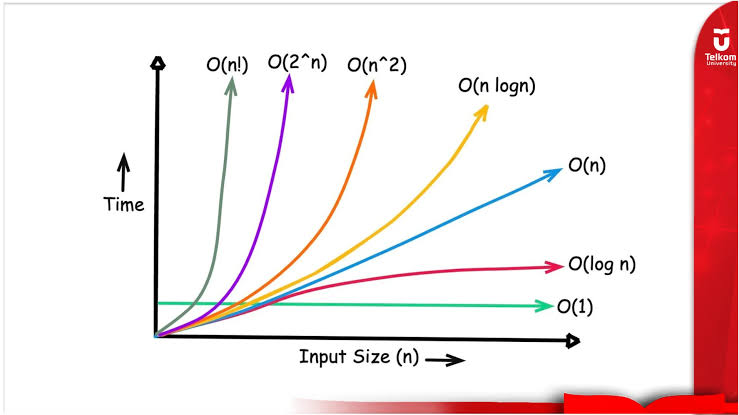

# Big O Natation
bahasa matematika yang digunakan dalam ilmu komputer untuk mendeskripsikan seberapa efisien sebuah algoritma. Alih-alih mengitung kecepatan dalam satuan "deti" (yang bisa berbeda tergantung spesifikasi laptop Kita). Big O mengukur bagaimana waktu eksekusi atau penggunaan memori meningkat seiring dengan bertambahnya jumlah data (ipnput size atau n)

Big selalu mengasumsikan skenario terburuk (worst-case scenario).

