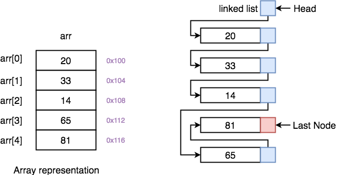

# Arrays and Linked lists

Array dan Linked List terletak pada cara memori komputer dalokasikan untuk mnyimpan elemen-elemennya. 
Perbedaan arsitektur ini berdampak langusng pada performa program yang kita buat.

## Array (Memori Berdekatan / contiguous)
    Elemen-elemen disimpan secara berurutan dalam blok memori yang letaknya bersebelahan

- Keunggulan Utama (Akses Cepat):
    Komputer dapat langsungmenghitung dan melompat ke lokasi elemen ke-n secara instan. Kecapatan aksesnya adalah O(1).

- Kelemehan (Tidak Fleksibel): 
    Ukuran array pada dasarnya tetap. Jika kita ingin menyisipkanatau menghapus data di tengah array, kmoputer harus menggeser posisi semua data yang ada di belakangnya agar tidak ada ruang kosong, sehingga proses operasinya memakan waktu O(n)

## Linked List (Memori Tersebar / Non-contiguous)
    Elemen-elemen (yang disebut Node) disimpan secara tersebar di memori.
Untuk menghubungkannya, setaip Node wajib menyimpan dua hal; data itu sendiri dan referensi/pointer yang menunjuk ke alamat Node berikutnya

- Keunggulan Utama (Modifikasi Cepat):
    Sangat dinamis. Untuk menyisipkan atau menghapus elemen di tengah. Kita tidak perlu menggeser data lain. Kita hanya perlu memutuskan dan menyambungkan kembali garis pointer-Nya. Waktu eksekusinya bisa mencapai O(1) jika posisinya sudah diketahui.

- Kelemahan (Akses Lambat & Boros):
    Kita tidak bisa melompat langusng ke indeks tertentu. untuk mencari elemen ke-5, komputer harus menelusuri rantai dari elemen 1, ke 2, ke 4, dan seterusnya(O(n)). Selain itu, penyimpanan referensi/pointer membutuhkan alokasi memori tambahan

## Ringakasan Perbandingan
|fitur |Array|Linked Lilst|
|:---:|:---:|:---:
|Alokasi Memori|Berdekatan(contiguous)|Tersebar (Non-contigous)|
|Akses Data(Membaca)|Cepat, O(1) menggunakan indeks|Lambat, O(n) harus menelusuri node|
|Penggunaan Memori|Lebih efisin (hanya menyimapn data)|Sedikit boros (harus menyimpan data + pointer)|
|Kapan Digunakan?|jika aplikasi lebih sering membaca data berdasarkan indeks.|Jika aplikasi sering menyisipkan atau menghapus data secara acak.|
