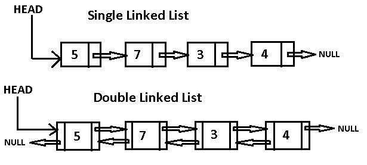

# Singly Linked List dan Doubly Linked List
    adalah dua variase struktur data Linked List yang dibedakan secara mendasar oleh jumlah referensi(pointer) yang di miliki setiap elemennya (node).
Pervedaan arsitektur ini secara langsung memengaruhi arah navigasi data dan seberapa banyak memori yang dikosumsi oleh program

## Singly Linked List
    Setiap node hanya menyimpan data dan satu pointer(next) yang menunjuk ke node berikutnya dalam rantai.

- Kelebihan:
    - Kapasitas Memor Lebih Kecil: Sangat efisien karena hanya membutuhkan ruang untuk satu poiter per elemen
    - Implementasi Sederhana: Kode untuk menambah elemen di awal atau akhir relatif lebih ringkas.

- Kekurangan:
    - Navigasi Satu Arah (Unidirectional): Kita hanya bisa membaca data dari depan (Head) ke belakang. Jika Kita kelewatan satu node, Kita harus mengulang penelusuran dari awal.
    - Penghapusan Node Sulit: Untuk menghapus sebuah node di tengah Kita wajib memiliki referensi dar inode sebelumnya untuk menyambungkan ulang rantai.

## Doubly Linked List
    Setiap node menyimpan data dan dua pointer: satu menunjuk ke node berikutnya(next), dan satu lagi menunjuk kembali ke node sebelumnya(prev).

- Kelebihan:
    - Navigasi Dua Arah (Bidirectional): Kita daapt menelusuri data maju maupun mundur dengan sama efesiennya. Sangat cocok untuk fitur seperti "Undo/Redo" atau tombol Next/Previous pada pemutar musik.
    - Penghapusan Lebih Cepat: Jika Kita sudah berada di node yang ingin dihapus. Kita bisa langsung menghapusnya tanpa perlu mencari node sebelumnya dari awal, karena ia sudah terhubung secara langsung.

- Kekurangan:
    - Konsumis Memori Ekstra: Setiap node memakan memori lebih besar karena harus menyimpan dua pointer.
    - Operasi Lebih Kompleks: Setiap kali kita menambah atau menghapus data. Kita harus berhati-hati memperbarui dua pionter sekaligus(next dan prev). Kesalahan kecil bisa merusak struktur list.

## Ringkasan Perbandingan

|Fitur|Singly Linked List|Doubly Linked List|
|:---:|:---:|:---:|
|Strukter Node|[Data \ Next]|[Prev \ Data \ Next]|
|Arah Iterasi|Hanya Maju|Maju dan Mundur|
|Penggunaan Memori|Lebih Rendah|Lebih Tinggi|
|Kompleksitas Kode|Relatif Sederhana|Lebih Kompleks|