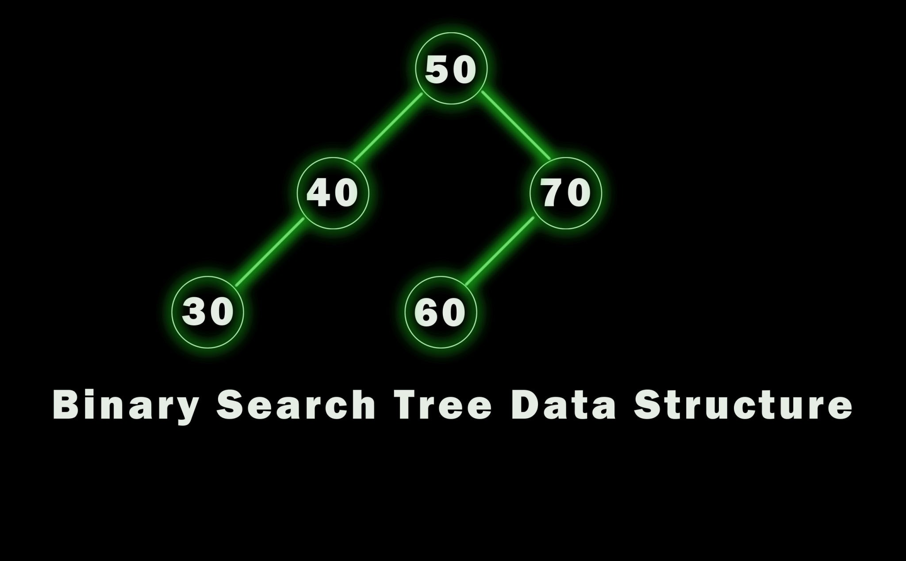

# Tree (Pohon) adalah struktur data hierarkis
    Pikiran Tree seperti bagan struktur organisasi di sebuah peusahaan, silsilah keluarga, atau sistem folder (direktori) di komputer Kita, di mana satu folder utama bisa berisi banyak sub-folder di bawahnya

## Terminologi Penting dalam Tree
- Node              : Setiap elemen individual di dalam Tree yang menyimpan data.

- Root (Akar)       : Node palnig atas dan pertama dalam Tree. Root tidak memiliki atasan.

- Edge (Garis)      : Garis penghubung (koneksi) antara satu node dengan node lainnya.

- Parent & Child    : Jika node A terhubung ke node B di bawahnya, maka A adalah Parent (Induk) dan B adalah Child (Anak).

- Leaf (Daun)       : Node paling ujung bawah yang sudah tidak memiliki anak lagi.

### Struktur Data Tree
https://share.gemini.google/cBWcQJxbdhLQ

## Binary Tree (Pohon Biner)
Binary Tree adlaah jenis Tree khusus dan yang paling sering digunakan dalam pemrograman. 
Aturannya sangat ketat namun sederhana: Setiap Node maksimal hanya boleh memiliki DUA anak (sering disebut sebagai anak kiri (Left Child) dan anak kanan (Right Child)).

Beberapa algoritma pencarian tercepat (seperti Binary Search Tree) bergantung pada struktur ini karena kemampuannya membagi data menjadi dua bagian di setiap cabangnya, membuat proses pencarian data O(log n) sangat efisien.

